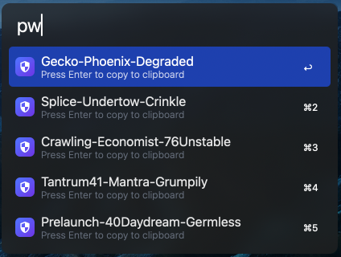

# passphrase

Alfred workflow that generates passphrases using [EFF Dice-Generated Passphrases](https://www.eff.org/dice).

Written in Go for fast, instant results.

Diceware passphrases are strong because their security comes from the sheer size of the wordlist - with 7,776 possible words per position, even a 3-word passphrase represents an enormous number of combinations for an attacker to brute-force. Unlike random strings of characters, they're made up of real words, making them far easier to remember and type without sacrificing security. Adding a number at a random position increases entropy further while keeping the passphrase readable.

## Usage

Generate secure, memorable passphrases from the EFF large wordlist via the `pw` keyword.



Invoking `pw` returns 5 passphrase suggestions. Each is made up of randomly selected words from the EFF large wordlist (7,776 words), joined by hyphens with each word capitalized.

The first 2 suggestions are plain word-only passphrases. The remaining 3 each include a random number (1–100) inserted at a random position.

```
Apple-River-Stone
Marble-Cloud-Fence
Forest42-Blanket-Harbor
88Candle-Storm-Pillow
Rocket-9Ladder-Crane
```

Pass a number after `pw` to set how many words to use:

```
pw 2  →  2-word passphrases
pw 4  →  4-word passphrases
pw 5  →  5-word passphrases
```

Valid range is **2–5**. Values outside this range are clamped to the nearest bound.

## Configuration

Passphrases use 3 words by default. To change this, set `WORD_COUNT` in the Workflow's Configuration.

| Variable     | Example value |
| ------------ | ------------- |
| `WORD_COUNT` | 2             |

Setting `WORD_COUNT=2` means `pw` will always generate 2-word passphrases. An inline argument (e.g. `pw 4`) always takes priority over `WORD_COUNT`.

---

For setup and development details, see [DEVELOPMENT.md](DEVELOPMENT.md).
